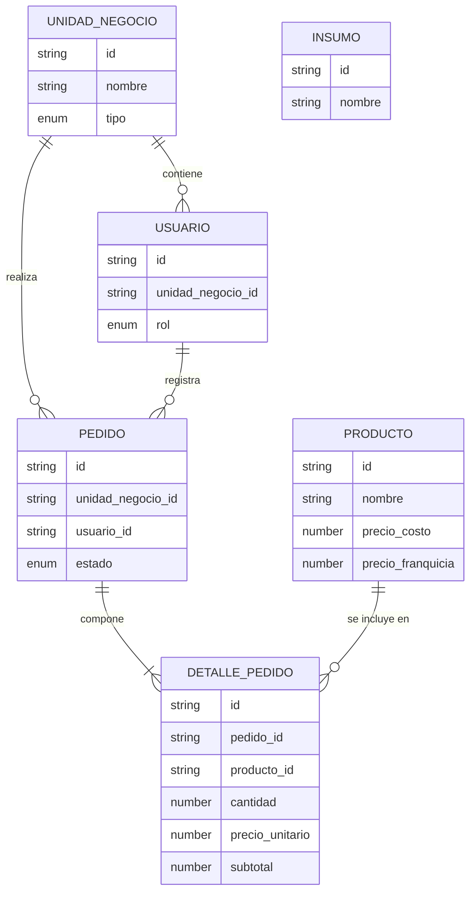

# API RESTful - Sistema de Gestión de Pedidos "La Espiga de Oro S.R.L."
## Descripción del Proyecto
Backend transaccional diseñado para estructurar y centralizar la cadena de suministro interno de una panificadora con estructura matricial (Planta Central, Sucursales Propias y Franquicias). 

El sistema expone un motor de operaciones CRUD interrelacionadas diseñado para erradicar la asimetría de información en la captura de pedidos, garantizando la integridad referencial y bloqueando transacciones inconsistentes. 

**Características Técnicas Principales:**
* **Arquitectura Modular por Capas:** Separación estricta de responsabilidades (Rutas, Controladores, Servicios y Modelos).
* **Control de Acceso Basado en Roles (RBAC):** Segregación de permisos y visibilidad de datos (precios de costo vs. precios de venta) dependiente de la Unidad de Negocio del usuario autenticado.
* **Máquina de Estados Finita:** Control auditado del ciclo de vida de los pedidos (`PENDIENTE` -> `EN_PRODUCCION` -> `DESPACHADO` -> `ENTREGADO`), con bloqueos transaccionales duros contra modificaciones en etapas avanzadas.
* **Gestión de Dependencias (Soft Deletes):** Prevención de eliminación de registros maestros (Unidades de Negocio, Productos) vinculados a transacciones históricas.
* **Agregación de Datos:** Endpoints estratégicos para el cálculo de demanda consolidada (producción) y base imponible (royalties).

**Stack Tecnológico:**
* Entorno: Node.js
* Framework: Express.js
* Persistencia: Almacenamiento en memoria (Fase 1 - MVP), diseñado con interfaces preparadas para inyección NoSQL (MongoDB) en futuras iteraciones.
---
## Índice
1. [Introducción y Propósito del Sistema](#1-introducción-y-propósito-del-sistema)
2. [Delimitación del Alcance (Fases de Implementación)](#2-delimitación-del-alcance-fases-de-implementación)
3. [Matriz de Actores y Control de Acceso (RBAC)](#3-matriz-de-actores-y-control-de-acceso-rbac)
4. [Modelo de Dominio y Diccionario de Datos](#4-modelo-de-dominio-y-diccionario-de-datos)
5. [Interrelación de Módulos (Diseño Relacional Lógico)](#5-interrelación-de-módulos-diseño-relacional-lógico)
6. [Máquina de Estados: Ciclo de Vida del Pedido](#6-máquina-de-estados-ciclo-de-vida-del-pedido)
7. [Reglas de Negocio, Validaciones y Manejo de Errores](#7-reglas-de-negocio-validaciones-y-manejo-de-errores)
8. [Especificación de Operaciones CRUD por Módulo](#8-especificación-de-operaciones-crud-por-módulo)
9. [Consultas Estratégicas (Endpoints de Lectura Agrupada)](#9-consultas-estratégicas-endpoints-de-lectura-agrupada)
10. [Estrategia de Implementación Ágil (Scrum)](#10-estrategia-de-implementación-ágil-scrum)
11. [Arquitectura y Stack Tecnológico](#11-arquitectura-y-stack-tecnológico)

---

## 1. Introducción y Propósito del Sistema

### 1.1 Contexto del Negocio
"La Espiga de Oro S.R.L." es una panificadora industrial que opera bajo una estructura matricial descentralizada. Su red comercial está compuesta por tres entidades principales:
* **1 Planta Central:** Encargada de la producción centralizada de masas y productos terminados.
* **5 Sucursales Propias:** Unidades de negocio internas que adquieren productos a valor de costo operativo.
* **10 Franquicias:** Unidades de negocio externas con autonomía comercial, que adquieren productos a precio de venta mayorista y están sujetas al pago de royalties.

Actualmente, la empresa presenta una vulnerabilidad crítica en su cadena de suministro interno (*Supply Chain*). La captura de pedidos se realiza mediante canales informales y no estructurados (aplicaciones de mensajería, llamadas). Esta carencia de un flujo transaccional centralizado genera:
1. Incapacidad de la Planta para planificar la producción de manera eficiente (visibilidad nula de la demanda agregada).
2. Dificultades en la compra de materia prima, generando quiebres o excesos de stock.
3. Tensiones operativas con los franquiciados por demoras en las entregas, producto de la falta de estandarización en la captura de datos.

### 1.2 Objetivos Principales de la Solución
El propósito de este proyecto es el diseño y desarrollo de una API RESTful modular que actúe como motor central para la gestión de pedidos, articulando la comunicación transaccional entre la Planta y su red de distribución.

Los objetivos funcionales y técnicos primarios son:
1. **Estructuración de la Demanda:** Erradicar la informalidad mediante módulos CRUD interrelacionados que fuercen a los actores a generar solicitudes sobre un catálogo unificado, estandarizado por unidades de medida lógicas (*Vendor Packs*).
2. **Trazabilidad Operativa:** Implementar una máquina de estados estricta que audite el ciclo de vida del pedido (`Pendiente`, `En Producción`, `Despachado`, `Entregado`), bloqueando manipulaciones de datos inconsistentes (actualizaciones o eliminaciones en estados avanzados).
3. **Consolidación de Datos Estratégicos:** Exponer endpoints de lectura agrupada que faciliten la planificación productiva de la Planta (demanda consolidada) y provean datos limpios para conciliaciones administrativas (base imponible para royalties).
4. **Arquitectura Escalable:** Garantizar el cumplimiento de buenas prácticas de desarrollo (separación en modelos, controladores y rutas, validación de integridad referencial y manejo de códigos HTTP), preparando el entorno de memoria actual para una futura inyección de bases de datos persistentes.

## 2. Delimitación del Alcance (Fases de Implementación)

Para garantizar la viabilidad del proyecto, la trazabilidad técnica de las operaciones CRUD y el cumplimiento de las restricciones arquitectónicas (almacenamiento en memoria, separación modular), el desarrollo se estructurará en dos fases iterativas.

### 2.1 Fase 1: Producto Mínimo Viable (MVP) - EN ALCANCE
Esta fase conforma el núcleo de la entrega actual y contiene estrictamente los módulos interrelacionados necesarios para resolver la problemática principal de la captura de pedidos y el flujo de información.

Los elementos comprendidos en el desarrollo inicial son:
* **Módulo de Unidades de Negocio y Actores:** Gestión de las entidades (Planta, Sucursal, Franquicia) y los roles asociados a las mismas para la segregación de permisos transaccionales.
* **Módulo de Catálogo de Productos:** Gestión del listado unificado de panificados y masas, estandarizado mediante *Vendor Packs* y operando con una matriz de precios dual (Precio Costo y Precio Franquicia).
* **Módulo de Gestión de Pedidos:** Operaciones CRUD transaccionales completas (Cabecera y Detalle del pedido), gobernadas por la Máquina de Estados del negocio.
* **Validación e Integridad Referencial:** Lógica de validación cruzada en memoria (ej. prohibir la eliminación de un producto si pertenece a un pedido activo).
* **Endpoints Estratégicos (Lectura):** * Generación del reporte de *Demanda Consolidada* para la planificación de la Planta.
  * Generación del reporte de *Base Imponible para Royalties*, filtrando pedidos de franquicias en estado "Entregado".

### 2.2 Fase 2: Expansión Funcional - FUERA DE ALCANCE (Iteraciones Futuras)
Con el fin de evitar la dispersión funcional (*Scope Creep*) y mantener el enfoque en las interacciones principales, los siguientes requerimientos quedan excluidos de la Fase 1, pero la arquitectura dejará sentadas las bases para su futura integración:
* **Módulo de Insumos y Proveedores:** La planificación de compras y la gestión de materia prima cruda (ej. harina, levadura) se modelará en una etapa posterior. En la Fase 1, la Planta utilizará el reporte de "Demanda Consolidada" como insumo externo para sus compras.
* **Explosión de Materiales (BOM - Bill of Materials):** El sistema no calculará recetas ni desglosará cuánta materia prima se necesita por cada pedido de producto terminado.
* **Módulo Contable y Facturación Electrónica:** El cálculo directo de impuestos, emisión de facturas y pasarelas de pago no forman parte del sistema central. El sistema solo proveerá la data cruda a los sistemas ERP externos.
* **Persistencia Física de Datos:** Según la directriz técnica actual, el almacenamiento operará en memoria volátil. La inyección de dependencias hacia bases de datos físicas (ej. MongoDB) está planificada como una actualización técnica futura.

## 3. Matriz de Actores y Control de Acceso (RBAC)

El sistema implementa un modelo de Control de Acceso Basado en Roles (RBAC), donde los permisos no se asignan individualmente, sino a través de funciones predefinidas vinculadas a una **Unidad de Negocio**.

### 3.1 Definición de Unidades de Negocio (Entidades)
Para este sistema, un usuario siempre debe pertenecer a una de las siguientes entidades:
1. **Planta Central:** El núcleo productivo y administrativo.
2. **Sucursal Propia:** Unidad de venta interna (5 locaciones).
3. **Franquicia:** Unidad de venta externa bajo contrato (10 locaciones).

### 3.2 Roles de Usuario
Se definen tres niveles de acceso con responsabilidades diferenciadas:

#### A. ADMIN_PLANTA (Administrador de Planta)
* **Perfil:** Personal jerárquico de la fábrica.
* **Alcance:** Visibilidad total del sistema (*Admin Mode*).
* **Responsabilidad:** Gestionar el catálogo, dar de alta unidades de negocio, gestionar órdenes de insumos y controlar el flujo de producción de todos los pedidos recibidos.

#### B. ENCARGADO_SUCURSAL (Gestión Interna)
* **Perfil:** Responsable de una de las 5 sucursales propias.
* **Alcance:** Visibilidad restringida a su propia sucursal.
* **Responsabilidad:** Realizar pedidos de reposición a la Planta y consultar el historial de entregas de su unidad.

#### C. FRANQUICIADO (Gestión Externa)
* **Perfil:** Dueño o encargado de una franquicia externa.
* **Alcance:** Visibilidad restringida únicamente a sus transacciones.
* **Responsabilidad:** Realizar pedidos estructurados a través del portal y consultar sus saldos proyectados para royalties.

### 3.3 Matriz de Permisos Transaccionales (CRUD)

| Módulo | Operación | Admin Planta | Encargado Sucursal | Franquiciado |
| :--- | :--- | :---: | :---: | :---: |
| **Productos** | Crear/Editar/Borrar | Sí | No | No |
| | Ver Catálogo / Precios | Sí | Sí (Costo) | Sí (Venta) |
| **UnidadNegocio** | Crear/Editar/Borrar | Sí | No | No |
| | Ver Datos Propios | Sí | Sí | Sí |
| **Pedidos** | Crear nuevo | No | Sí | Sí |
| | Editar/Cancelar (PENDIENTE) | Sí | Sí (Propios) | Sí (Propios) |
| | Cambiar Estado (PROD/DESP/ENTR) | Sí | No | No |
| | Ver Listado Completo | Sí | No | No |
| | Ver Listado Propio | Sí | Sí | Sí |
| **Insumos** | Crear/Editar/Borrar | Sí | No | No |
| | Consultar Stock/Precios | Sí | No | No |

### 3.4 Reglas de Privacidad y Seguridad de Datos
1. **Aislamiento de Datos:** Ningún usuario de tipo `FRANQUICIADO` o `ENCARGADO_SUCURSAL` podrá acceder a registros de pedidos cuya `unidad_negocio_id` no coincida con la suya. Cualquier intento de acceso vía ID directo deberá resultar en un error `403 Forbidden`.
2. **Jerarquía de Precios:** El sistema debe filtrar automáticamente el campo de precio mostrado en el catálogo basándose en el tipo de entidad del usuario autenticado, garantizando que el `ENCARGADO_SUCURSAL` nunca visualice el margen de venta de la franquicia y viceversa.

## 4. Modelo de Dominio y Diccionario de Datos

El diseño de datos está concebido bajo el paradigma de Programación Orientada a Objetos (POO) para ser implementado en Node.js/Express. Para la Fase 1 (almacenamiento en memoria), las colecciones se instanciarán como arreglos de objetos. Los identificadores (`id`) serán cadenas alfanuméricas (UUIDs) para facilitar la migración futura a bases de datos relacionales o NoSQL (MongoDB).

### 4.1 Entidades del Core de Negocio

#### 4.1.1 UnidadNegocio
Representa las distintas locaciones físicas e institucionales de la red.
* `id` (String/UUID): Identificador único.
* `nombre` (String): Nombre de fantasía o razón social.
* `tipo` (Enum): `['PLANTA', 'SUCURSAL', 'FRANQUICIA']`.
* `direccion` (String): Ubicación física.
* `activo` (Boolean): Bandera para baja lógica (Soft Delete).

#### 4.1.2 Usuario
Actor que interactúa con el sistema.
* `id` (String/UUID): Identificador único.
* `nombre` (String): Nombre completo del operador.
* `email` (String): Correo electrónico (único, usado para autenticación).
* `password` (String): Hash de la contraseña.
* `rol` (Enum): `['ADMIN_PLANTA', 'ENCARGADO_SUCURSAL', 'FRANQUICIADO']`.
* `unidad_negocio_id` (String/UUID): Referencia cruzada a la unidad operativa a la que pertenece.
* `activo` (Boolean): Bandera para baja lógica.

#### 4.1.3 Producto
Catálogo unificado de panificados y masas.
* `id` (String/UUID): Identificador único.
* `nombre` (String): Nombre descriptivo del producto.
* `descripcion` (String): Detalles técnicos o comerciales.
* `unidad_medida` (String): Formato de presentación estándar (Ej: "Vendor Pack x10").
* `precio_costo` (Number): Valor interno para Sucursales.
* `precio_franquicia` (Number): Valor de venta para Franquicias.
* `activo` (Boolean): Si está en `false`, no puede ser agregado a nuevos pedidos, pero mantiene el historial.

#### 4.1.4 Pedido
Cabecera transaccional que agrupa la solicitud de una Unidad de Negocio.
* `id` (String/UUID): Identificador único del pedido.
* `fecha_creacion` (Date/Timestamp): Fecha y hora de solicitud.
* `unidad_negocio_id` (String/UUID): Referencia a la Sucursal/Franquicia solicitante.
* `usuario_id` (String/UUID): Referencia al operador que registró el pedido.
* `estado` (Enum): `['PENDIENTE', 'EN_PRODUCCION', 'DESPACHADO', 'ENTREGADO']`.
* `total` (Number): Monto total calculado al momento del cierre (congelado).

#### 4.1.5 DetallePedido
Líneas de los ítems solicitados dentro de un pedido. En un entorno Node/Express, esto será una clase vinculada a la cabecera.
* `id` (String/UUID): Identificador único de la línea.
* `pedido_id` (String/UUID): Referencia a la cabecera.
* `producto_id` (String/UUID): Referencia al producto del catálogo.
* `cantidad` (Number): Cantidad de *Vendor Packs* solicitados.
* `precio_unitario` (Number): Precio fijado al momento de la creación (costo o franquicia, según el rol).
* `subtotal` (Number): `cantidad * precio_unitario`.

### 4.2 Entidades Aisladas (Fase 1)

#### 4.2.1 Insumo
Catálogo de materias primas crudas gestionado exclusivamente por la Planta.
* `id` (String/UUID): Identificador único.
* `nombre` (String): Nombre del insumo (ej. "Harina 0000").
* `unidad_medida` (String): Kilos, Litros, Unidades.
* `stock_actual` (Number): Cantidad disponible en planta.
* `punto_pedido` (Number): Nivel mínimo de stock para alertar reposición.
* `activo` (Boolean): Bandera para baja lógica.

## 5. Interrelación de Módulos (Diseño Relacional Lógico)

Esta sección describe cómo las entidades del sistema interactúan entre sí. La integridad referencial es mandatoria: ningún registro "hijo" puede existir sin una referencia válida a un registro "padre".

## 5. Interrelación de Módulos (Diseño Relacional Lógico)

Esta sección describe cómo las entidades del sistema interactúan entre sí. La integridad referencial es mandatoria: ningún registro "hijo" puede existir sin una referencia válida a un registro "padre".

### 5.1 Diagrama de Entidad-Relación



### 5.2 Análisis de Cardinalidad y Dependencias

1. **UnidadNegocio -> Usuario (1:N):** Una Unidad de Negocio (Planta, Sucursal o Franquicia) puede tener múltiples usuarios operando el sistema, pero cada usuario pertenece estrictamente a una sola unidad.
2. **UnidadNegocio -> Pedido (1:N):** Es la relación principal de "Cliente". Un pedido siempre debe estar anclado a una Unidad de Negocio solicitante.
3. **Usuario -> Pedido (1:N):** Relación de auditoría. Permite saber qué operador físico realizó la carga del pedido.
4. **Pedido -> DetallePedido (1:N):** Relación de composición fuerte. Si se elimina un pedido (Cabecera), todos sus detalles deben eliminarse en cascada (o quedar inaccesibles).
5. **Producto -> DetallePedido (1:N):** Relación de catálogo. Un producto puede aparecer en infinitos detalles de pedidos, pero el detalle debe "congelar" el precio del producto al momento de la creación para evitar alteraciones históricas.

### 5.3 Restricciones de Integridad (Validaciones CRUD)

Para cumplir con las buenas prácticas de manejo de errores solicitadas, el backend implementará las siguientes restricciones:

* **Restricción de Eliminación de Unidad de Negocio:** No se podrá eliminar (ni desactivar) una `UnidadNegocio` que posea pedidos con estado distinto a `ENTREGADO` (pedidos activos). 
* **Restricción de Eliminación de Producto:** No se permitirá la eliminación física de un `Producto` si este ID ya existe en alguna línea de `DetallePedido`. En su defecto, se procederá a un "Bloqueo de Venta" (`activo: false`) para preservar la integridad de los reportes históricos.
* **Validación de Existencia:** Al momento de ejecutar un `POST` en el módulo de Pedidos, el sistema debe validar mediante un middleware que tanto el `usuario_id`, la `unidad_negocio_id` como todos los `producto_id` existan y estén en estado `activo: true`.

## 6. Máquina de Estados: Ciclo de Vida del Pedido

El procesamiento de pedidos no es estático; fluye a través de una secuencia de estados predefinidos que representan la realidad operativa de la Planta. El sistema implementa una máquina de estados finita que dicta qué operaciones CRUD están permitidas y quién puede ejecutarlas en cada etapa.

### 6.1 Definición de Estados

1. **PENDIENTE**: Estado inicial por defecto al crear un pedido (`POST`). Significa que la Unidad de Negocio ha emitido la solicitud, pero la Planta aún no ha comenzado su procesamiento. Es el único estado "abierto" a modificaciones externas.
2. **EN_PRODUCCION**: La Planta ha validado el pedido y ha comenzado a amasar/preparar los productos. A partir de este momento, el pedido queda **congelado** para el solicitante.
3. **DESPACHADO**: Los productos han salido físicamente de la Planta hacia la Sucursal o Franquicia. 
4. **ENTREGADO**: Estado final que cierra el ciclo del pedido. La Unidad de Negocio confirma la recepción. Alcanzar este estado convierte al pedido en un registro elegible para auditorías, cálculo de demanda histórica y facturación de royalties.

### 6.2 Matriz de Transición de Estados

La transición entre estados debe ser secuencial para mantener la consistencia logística. El backend validará que no se puedan saltar etapas (ej. pasar de PENDIENTE a ENTREGADO directamente), salvo casos de excepción documentados.

| Estado Actual | Transición Permitida a | Actor Autorizado | Método HTTP | Regla de Negocio / Bloqueo |
| :--- | :--- | :--- | :---: | :--- |
| **N/A** (Nuevo) | `PENDIENTE` | Encargado Sucursal / Franquiciado | `POST` | Valida stock activo y referencias válidas. |
| `PENDIENTE` | `EN_PRODUCCION` | Admin Planta | `PATCH` | Bloquea futuras ediciones (`PUT`/`DELETE`) por parte del creador. |
| `EN_PRODUCCION` | `DESPACHADO` | Admin Planta | `PATCH` | Requiere que el pedido tenga al menos una línea de detalle. |
| `DESPACHADO` | `ENTREGADO` | Admin Planta / Solicitante | `PATCH` | Cierra la transacción. Habilita el cálculo de royalties si es Franquicia. |

### 6.3 Reglas de Bloqueo Transaccional (CRUD Restringido)

Para satisfacer las normativas de negocio y evitar inconsistencias operativas (ej. que una franquicia cancele un pedido cuando la planta ya gastó materia prima en prepararlo), se aplican las siguientes reglas duras a nivel API:

* **Update (Modificación de Detalle):** El endpoint `PUT /pedidos/{id}` solo responderá con código `200 OK` si el estado actual del pedido es `PENDIENTE`. Cualquier intento de modificación en estados posteriores retornará un código `409 Conflict`.
* **Delete (Baja Lógica / Cancelación):** El endpoint `DELETE /pedidos/{id}` está restringido bajo la misma premisa que la modificación. Solo el creador original (o un Admin Planta) puede cancelar un pedido, y exclusivamente mientras se encuentre en estado `PENDIENTE`.

## 7. Reglas de Negocio, Validaciones y Manejo de Errores

Para garantizar la integridad del sistema y cumplir con los requerimientos de robustez, la API debe implementar validaciones estrictas en la capa de entrada (middlewares) y en la capa de servicios, devolviendo respuestas JSON estandarizadas con códigos HTTP semánticos.

### 7.1 Validaciones de Integridad Referencial (Códigos HTTP 400 y 404)
El sistema no puede procesar transacciones con datos huérfanos. Antes de cualquier operación de escritura (`POST`, `PUT`, `PATCH`), se debe verificar la existencia y estado de las referencias:
* **Pedidos:** Al crear un pedido, si el `unidad_negocio_id` o el `usuario_id` no existen en memoria, la API debe rechazar la petición con un `404 Not Found` (o `400 Bad Request` indicando "Referencia inválida").
* **Detalle de Pedidos:** Si en el payload del pedido se incluye un `producto_id` que no existe o cuyo estado es `activo: false`, la transacción completa debe ser abortada (Rollback lógico) retornando un `409 Conflict` indicando "El producto X no se encuentra disponible".

### 7.2 Reglas de Negocio Transaccionales
1. **Asignación Dinámica de Precios:** El frontend (o cliente REST) **no** envía el precio al crear un pedido, solo envía el `producto_id` y la `cantidad`. Es responsabilidad absoluta del backend calcular el precio en base al `rol` / `tipo` de Unidad de Negocio del solicitante:
    * Si el tipo es `FRANQUICIA` -> Aplica `precio_franquicia`.
    * Si el tipo es `SUCURSAL` -> Aplica `precio_costo`.
2. **Congelamiento de Valor:** Una vez guardado el `DetallePedido`, el `precio_unitario` y el `subtotal` quedan inmutables. Si un administrador actualiza el precio en el Módulo Productos al día siguiente, los pedidos históricos no deben recalcularse.

### 7.3 Restricciones de Baja y Dependencias Críticas (Código HTTP 409)
El sistema emplea un modelo de **Baja Lógica** (`Soft Delete`) mediante el flag `activo: boolean`. Las reglas para operar el endpoint `DELETE` son:

* **Eliminación de Unidad de Negocio:** * 
  * *Regla:* No se puede dar de baja una Sucursal o Franquicia si tiene pedidos en estado `PENDIENTE`, `EN_PRODUCCION` o `DESPACHADO`.
  * *Error:* `409 Conflict` - "Existen pedidos activos asociados a esta unidad".
* **Eliminación de Productos:**
  * *Regla:* Si un producto ya forma parte de un `DetallePedido` (histórico o activo), no se puede borrar de la base de datos para no romper la integridad de los reportes. Se debe ejecutar un `UPDATE` pasando `activo: false`.
  * *Error (si se intenta borrado físico):* `409 Conflict` - "Violación de restricción de llave foránea / Dependencia histórica".
* **Eliminación de Pedidos:**
  * *Regla:* Como se definió en la Máquina de Estados, solo se permite la cancelación (`DELETE` lógico) si el estado es `PENDIENTE`.
  * *Error:* `403 Forbidden` o `409 Conflict` - "El pedido ya se encuentra en producción y no puede ser cancelado".

### 7.4 Formato Estándar de Respuesta de Errores
Toda respuesta de error generada por la API debe mantener un contrato JSON estricto para facilitar su consumo por parte de futuras interfaces de usuario:

```json
{
  "error": true,
  "codigo_http": 409,
  "mensaje": "El pedido ya se encuentra en producción y no puede ser cancelado.",
  "detalles": [
    "pedido_id: P-001",
    "estado_actual: EN_PRODUCCION"
  ]
}
```

## 8. Especificación de Operaciones CRUD por Módulo

Esta sección detalla el comportamiento transaccional de la API. Cumpliendo con el requerimiento del TP ("interacción entre módulos"), las operaciones no actúan sobre entidades aisladas, sino que resuelven las dependencias relacionales en cada petición.

### 8.1 Módulo: Catálogo de Productos (`/api/productos`)
Gestiona la oferta unificada de panificados de la Planta.

* **C (POST):** Crea un nuevo producto. Requiere validación estricta de campos obligatorios (`nombre`, `unidad_medida`, `precio_costo`, `precio_franquicia`).
* **R (GET):** Lista los productos activos. **Regla de interacción:** El controlador intercepta el `rol` / `tipo` de la Unidad de Negocio del usuario logueado y devuelve únicamente el precio que le corresponde (ocultando el margen de la otra unidad).
* **U (PUT):** Actualiza datos del producto. Si se actualiza el precio, no se deben alterar los `DetallePedido` históricos.
* **D (DELETE):** Baja lógica (`activo: false`). **Validación de dependencia:** Si el `producto_id` existe en cualquier `DetallePedido` (histórico o activo), el sistema prohíbe el borrado físico para mantener la integridad referencial y fuerza el Soft Delete.

### 8.2 Módulo: Gestión de Pedidos (`/api/pedidos`)
Motor principal del sistema. Interactúa cruzando datos con `UnidadNegocio`, `Usuario` y `Producto`.

* **C (POST - Alta de registro):** * *Acción:* Crea la cabecera del `Pedido` y sus múltiples `DetallePedido` (Relación 1:N).
  * *Interacción y Validación:* El payload recibe el ID de la unidad, ID de usuario y un arreglo de productos con cantidades. El middleware verifica que la unidad exista, que el usuario pertenezca a la misma, y que todos los productos estén `activo: true`. Falla con `400` o `404` si hay inconsistencias. Congela el precio unitario en el detalle según el rol.
* **R (GET - Consulta de registros):**
  * *Acción:* Devuelve el historial de pedidos filtrado según el RBAC (Propios para Sucursales/Franquicias, Todos para Planta).
  * *Interacción (Join Lógico):* Muestra el pedido inyectando la información relacionada (Nombre de la Unidad de Negocio en la cabecera, y Nombre del Producto en cada línea de detalle).
* **U (PUT - Actualizar registro):**
  * *Acción:* Modifica cantidades o productos de un pedido existente. Recalcula el total.
  * *Regla de Estado:* Solo ejecutable en estado `PENDIENTE`. Retorna `409 Conflict` en cualquier otro estado.
* **D (DELETE - Eliminar/Cancelar registro):**
  * *Acción:* Baja lógica del pedido completo.
  * *Regla de Estado:* Solo ejecutable en estado `PENDIENTE`. 

### 8.3 Módulo: Unidades de Negocio y Actores (`/api/unidades`)
* **C/R/U:** Alta, consulta y modificación de locaciones (Planta, Sucursales, Franquicias).
* **D (DELETE):** **Dependencia crítica:** Retorna error `409 Conflict` si se intenta eliminar una Unidad de Negocio que posea pedidos asociados cuyo estado sea distinto a `ENTREGADO`.

## 9. Consultas Estratégicas (Endpoints de Lectura Agrupada)

Para cumplir con el requerimiento de "generar información útil para la planificación productiva y la conciliación de facturación", se exponen endpoints de lectura (`GET`) con lógica interna de agregación y filtrado.

### 9.1 Reporte de Demanda Consolidada (Planificación de Producción)
Uso exclusivo del `ADMIN_PLANTA`. Sumariza qué productos deben ser producidos agrupando los detalles de los pedidos entrantes.

* **Endpoint:** `GET /api/reportes/demanda`
* **Lógica de Agregación:**
  1. Filtra los pedidos que estén estrictamente en estado `PENDIENTE`.
  2. Extrae los `DetallePedido` de esas cabeceras.
  3. Agrupa por `producto_id` y suma la `cantidad` total (Vendor Packs).
* **Estructura de Salida Esperada:**

```json
{
    "reporte": "Demanda Consolidada",
    "fecha_corte": "2026-04-12T10:00:00Z",
    "totales_produccion": [
        { "producto_id": "UUID-1", "producto_nombre": "Pan de Hamburguesa", "cantidad_total_vendor_packs": 150 },
        { "producto_id": "UUID-2", "producto_nombre": "Masas Secas", "cantidad_total_vendor_packs": 45 }
    ]
}
```

### 9.2 Reporte de Base Imponible y Royalties
Permite visualizar la deuda acumulada en concepto de uso de marca. Aplica exclusivamente a Franquicias.

* **Endpoint:** `GET /api/reportes/royalties/:unidad_negocio_id`
* **Lógica de Agregación:**
  1. Filtra pedidos por el `unidad_negocio_id` solicitado.
  2. Excluye cualquier pedido que no esté en estado `ENTREGADO`.
  3. Sumariza el campo `total` de las cabeceras resultantes.
  4. Calcula el 5% sobre el total acumulado.
* **Estructura de Salida Esperada:**

```json
{
    "unidad_negocio_id": "UUID-FRA-001",
    "periodo_calculo": "04-2026",
    "pedidos_entregados_qty": 12,
    "total_facturado": 1500000.00,
    "canon_royalty_pct": 5.0,
    "total_a_pagar": 75000.00
}
```

## 10. Estrategia de Implementación Ágil (Scrum)

Para mitigar riesgos técnicos, evitar bloqueos por dependencias de datos y cumplir con la adopción progresiva solicitada por el negocio, la construcción de la Fase 1 (MVP) se ejecutará bajo el framework Scrum. El ciclo de desarrollo se estructurará en *Sprints* cortos, entregando incrementos funcionales al final de cada iteración.

### 10.1 Sprint 0: Arquitectura Base y Setup
* **Objetivo:** Preparar el entorno de desarrollo y establecer los cimientos del código.
* **Backlog Técnico:**
  * Inicialización del proyecto Node.js y Express.
  * Implementación de la estructura modular de carpetas (`/routes`, `/controllers`, `/services`, `/models`).
  * Desarrollo del middleware global para el manejo estandarizado de errores HTTP.
  * Setup de las estructuras de datos en memoria (arrays estáticos para simular las colecciones).

### 10.2 Sprint 1: ABM Core y Control de Acceso
* **Objetivo:** Desarrollar los catálogos y entidades base, los cuales no tienen dependencias foráneas fuertes.
* **Backlog Funcional:**
  * CRUD del módulo `UnidadNegocio`.
  * CRUD del módulo `Usuario` (incluyendo la lógica de vinculación RBAC con las unidades).
  * CRUD del módulo `Producto` (Catálogo con doble matriz de precios).
  * Implementación de restricciones de borrado (Validación inicial de dependencias).

### 10.3 Sprint 2: Motor Transaccional y Máquina de Estados
* **Objetivo:** Implementar la lógica central de pedidos, resolviendo la integridad referencial.
* **Backlog Funcional:**
  * Endpoint `POST /api/pedidos`: Creación de cabecera y líneas de detalle. Congelamiento de precios e inyección de validaciones (400/404).
  * Endpoint `GET /api/pedidos`: Historial de pedidos con inyección de datos relacionados (Nombres de productos y unidades).
  * Endpoints `PUT / DELETE`: Modificación y baja lógica, estrictamente bloqueadas al estado `PENDIENTE`.
  * Endpoint `PATCH /api/pedidos/:id/estado`: Motor de transición de la máquina de estados.

### 10.4 Sprint 3: Reportes Estratégicos y Cierre MVP
* **Objetivo:** Desarrollar la capa analítica de lectura compleja y preparar la entrega final.
* **Backlog Funcional:**
  * Endpoint `GET` de *Demanda Consolidada* (Lógica de filtrado y agrupamiento en memoria).
  * Endpoint `GET` de *Base Imponible para Royalties* (Cálculo porcentual sobre entidades finalizadas).
  * Auditoría final de códigos de error (400, 403, 404, 409).
  * Despliegue en entorno local/pruebas para revisión del docente.

## 11. Arquitectura y Stack Tecnológico

Para satisfacer los requerimientos de escalabilidad, mantenibilidad y la futura migración a bases de datos NoSQL, el sistema se construirá bajo una arquitectura modular basada en capas. 

### 11.1 Stack Tecnológico
* **Entorno de Ejecución:** Node.js.
* **Framework Web:** Express.js (para la gestión del enrutamiento y middleware).
* **Lenguaje:** JavaScript (ES6+).
* **Formato de Intercambio de Datos:** JSON (JavaScript Object Notation), tanto para los *payloads* de las peticiones (`req.body`) como para las respuestas (`res.json`).

### 11.2 Patrón de Diseño (Separación Modular)
El backend no será monolítico a nivel de archivos. Cada módulo de la aplicación (Usuarios, Productos, Pedidos) implementará una separación estricta de responsabilidades (SoC - *Separation of Concerns*):

1. **Capa de Rutas (`routes/`)**: Define los endpoints RESTful (URI y verbos HTTP). Su única responsabilidad es interceptar la petición y derivarla al controlador correspondiente.
2. **Capa de Controladores (`controllers/`)**: Maneja el objeto de petición (`req`) y respuesta (`res`). Extrae los parámetros, invoca la lógica de negocio y formatea la respuesta HTTP estándar con su código de estado.
3. **Capa de Servicios (`services/`)**: Contiene la lógica de negocio core y las validaciones de las reglas de estado y precios. Esta capa es agnóstica a Express (no conoce qué es `req` o `res`).
4. **Capa de Modelos y Persistencia (`models/` u `orm/`)**: 
   * **Fase 1 (Actual):** Estructuras de datos en memoria (Arreglos de objetos JS) que simulan tablas/colecciones. Proveen métodos de acceso estandarizados (`findAll()`, `findById()`, `create()`, etc.).
   * **Fase 2 (Futura):** Los métodos de acceso en memoria serán reemplazados por esquemas y modelos de un ODM como Mongoose, conectando de forma transparente con MongoDB, sin alterar la capa de Servicios.

### 11.3 Middlewares Estratégicos
Para mantener los controladores limpios, se implementarán funciones middleware para:
* **Parseo:** Conversión automática del body a JSON (`express.json()`).
* **Validación de Datos de Entrada:** Interceptores que validen la existencia de campos obligatorios antes de llegar al controlador.
* **Manejo Global de Errores:** Un interceptor final para capturar excepciones de servidor (500) o respuestas de negocio fallidas, estandarizando la salida JSON de error.