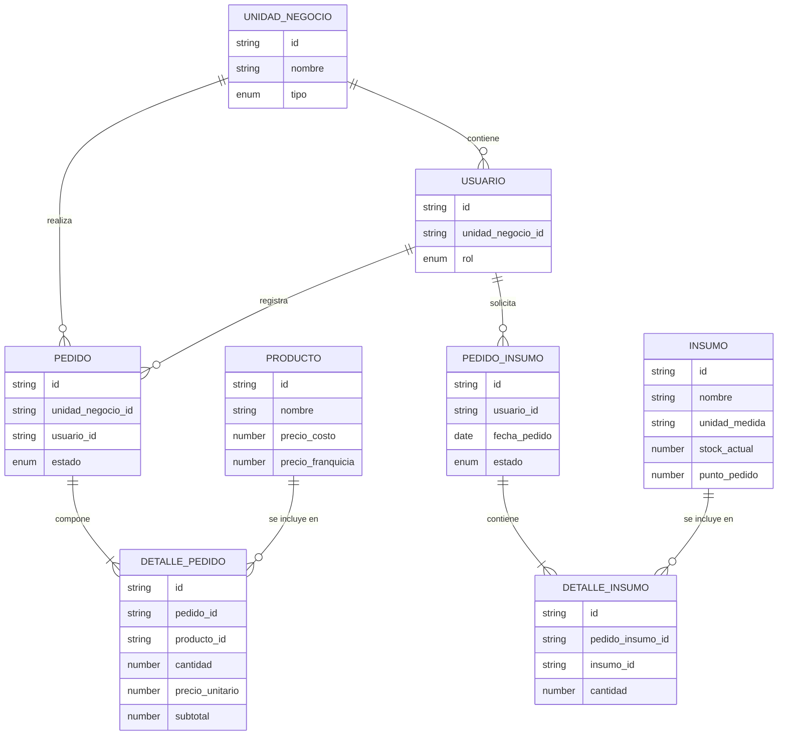

# Documentación Técnico/ Funcional: Sistema de Gestión de Pedidos - La Espiga de Oro S.R.L.

---
## Índice
1. [Introducción y Propósito del Sistema](#1-introducción-y-propósito-del-sistema)
2. [Delimitación del Alcance (Fases de Implementación)](#2-delimitación-del-alcance-fases-de-implementación)
3. [Matriz de Actores y Control de Acceso (RBAC)](#3-matriz-de-actores-y-control-de-acceso-rbac)
4. [Modelo de Dominio y Diccionario de Datos](#4-modelo-de-dominio-y-diccionario-de-datos)
5. [Interrelación de Módulos (Diseño Relacional Lógico)](#5-interrelación-de-módulos-diseño-relacional-lógico)
6. [Máquina de Estados: Ciclo de Vida del Pedido](#6-máquina-de-estados-ciclo-de-vida-del-pedido)
7. [Reglas de Negocio, Validaciones y Manejo de Errores](#7-reglas-de-negocio-validaciones-y-manejo-de-errores)
8. [Especificación de Operaciones CRUD por Módulo](#8-especificación-de-operaciones-crud-por-módulo)
9. [Consultas Estratégicas (Endpoints de Lectura Agrupada)](#9-consultas-estratégicas-endpoints-de-lectura-agrupada)
10. [Estrategia de Implementación Ágil (Scrum)](#10-estrategia-de-implementación-ágil-scrum)
11. [Arquitectura y Stack Tecnológico](#11-arquitectura-y-stack-tecnológico)
---

## 1. Introducción y Propósito del Sistema

### 1.1 Contexto del Negocio
"La Espiga de Oro S.R.L." es una panificadora industrial que opera bajo una estructura matricial descentralizada. Su red comercial está compuesta por tres entidades principales:
* **1 Planta Central:** Encargada de la producción centralizada de masas y productos terminados.
* **5 Sucursales Propias:** Unidades de negocio internas que adquieren productos a valor de costo operativo.
* **10 Franquicias:** Unidades de negocio externas con autonomía comercial, que adquieren productos a precio de venta mayorista y están sujetas al pago de royalties.

Actualmente, la empresa presenta una vulnerabilidad crítica en su cadena de suministro interno (*Supply Chain*). La captura de pedidos se realiza mediante canales informales y no estructurados (aplicaciones de mensajería, llamadas). Esta carencia de un flujo transaccional centralizado genera:
1. Incapacidad de la Planta para planificar la producción de manera eficiente (visibilidad nula de la demanda agregada).
2. Dificultades en la compra de materia prima, generando quiebres o excesos de stock.
3. Tensiones operativas con los franquiciados por demoras en las entregas, producto de la falta de estandarización en la captura de datos.

### 1.2 Objetivos Principales de la Solución
El propósito de este proyecto es el diseño y desarrollo de una API RESTful modular que actúe como motor central para la gestión de pedidos, articulando la comunicación transaccional entre la Planta y su red de distribución.

Los objetivos funcionales y técnicos primarios son:
1. **Estructuración de la Demanda:** Erradicar la informalidad mediante módulos CRUD interrelacionados que fuercen a los actores a generar solicitudes sobre un catálogo unificado, estandarizado por unidades de medida lógicas (*Vendor Packs*).
2. **Trazabilidad Operativa:** Implementar una máquina de estados estricta que audite el ciclo de vida del pedido (`Pendiente`, `En Producción`, `Despachado`, `Entregado`), bloqueando manipulaciones de datos inconsistentes.
3. **Gestión de Abastecimiento:** Integrar un módulo paralelo para el control de insumos y pedidos de materias primas que asegure la continuidad operativa de la Planta.
4. **Consolidación de Datos Estratégicos:** Exponer endpoints de lectura agrupada que faciliten la planificación productiva de la Planta (demanda consolidada) y provean datos limpios para conciliaciones administrativas (base imponible para royalties).
5. **Arquitectura Escalable:** Garantizar el cumplimiento de buenas prácticas de desarrollo (separación modular, validación referencial y manejo de códigos HTTP), preparando el entorno en memoria actual para la futura inyección de bases de datos persistentes.

## 2. Delimitación del Alcance (Fases de Implementación)

### 2.1 Fase 1: Producto Mínimo Viable (MVP) - EN ALCANCE
Esta fase conforma el núcleo de la entrega actual e incluye los módulos interrelacionados necesarios para resolver la problemática de captura de pedidos de venta y abastecimiento.

Elementos comprendidos:
* **Módulo de Unidades de Negocio y Actores:** Gestión de locaciones y control de acceso (RBAC).
* **Módulo de Catálogo de Productos:** Gestión del listado unificado de panificados con matriz de precios dual.
* **Módulo de Gestión de Pedidos (Ventas):** Operaciones CRUD de productos hacia las sucursales y franquicias.
* **Módulo de Gestión de Insumos (Abastecimiento):** ABM de materias primas y sistema de generación de pedidos de reposición exclusivos para la Planta.
* **Endpoints Estratégicos:** Reportes de Demanda Consolidada y Royalties.

### 2.2 Fase 2: Expansión Funcional - FUERA DE ALCANCE (Iteraciones Futuras)
* **Explosión de Materiales (BOM - Bill of Materials):** El sistema no calculará recetas ni desglosará cuánta materia prima se descuenta automáticamente por cada producto terminado.
* **Módulo Contable y Facturación Electrónica:** No incluye cálculo directo de impuestos, emisión de AFIP o pasarelas de pago.
* **Persistencia Física de Datos:** La inyección de dependencias hacia bases de datos físicas (ej. MongoDB) está planificada como actualización técnica futura.

## 3. Matriz de Actores y Control de Acceso (RBAC)

El sistema implementa un modelo de Control de Acceso Basado en Roles (RBAC) vinculado a la **Unidad de Negocio**.

### 3.1 Definición de Unidades de Negocio
1. **Planta Central**
2. **Sucursal Propia**
3. **Franquicia**

### 3.2 Roles de Usuario
* **A. ADMIN_PLANTA:** Personal jerárquico. Visibilidad total del sistema, gestión de catálogos e insumos, y control de producción.
* **B. ENCARGADO_SUCURSAL:** Gestión interna. Realiza pedidos a Planta y ve historial propio.
* **C. FRANQUICIADO:** Gestión externa. Realiza pedidos a Planta y ve saldos proyectados.

### 3.3 Matriz de Permisos Transaccionales (CRUD)

| Módulo | Operación | Admin Planta | Encargado Sucursal | Franquiciado |
| :--- | :--- | :---: | :---: | :---: |
| **Productos** | Crear/Editar/Borrar | Sí | No | No |
| | Ver Catálogo / Precios | Sí | Sí (Costo) | Sí (Venta) |
| **UnidadNegocio** | Crear/Editar/Borrar | Sí | No | No |
| | Ver Datos Propios | Sí | Sí | Sí |
| **Pedidos (Ventas)**| Crear nuevo | No | Sí | Sí |
| | Editar/Cancelar (PENDIENTE) | Sí | Sí (Propios) | Sí (Propios) |
| | Cambiar Estado | Sí | No | No |
| **Pedidos Insumos**| Crear/Editar/Borrar | Sí | No | No |
| | Consultar Stock | Sí | No | No |

## 4. Modelo de Dominio y Diccionario de Datos

Para la Fase 1, las colecciones se instanciarán en memoria. Los identificadores (`id`) serán UUIDs.

### 4.1 Entidades del Core de Negocio

#### 4.1.1 UnidadNegocio
* `id` (String/UUID)
* `nombre` (String)
* `tipo` (Enum): `['PLANTA', 'SUCURSAL', 'FRANQUICIA']`.
* `activo` (Boolean)

#### 4.1.2 Usuario
* `id` (String/UUID)
* `nombre` (String)
* `unidad_negocio_id` (String/UUID): Referencia cruzada.
* `rol` (Enum): `['ADMIN_PLANTA', 'ENCARGADO_SUCURSAL', 'FRANQUICIADO']`.
* `activo` (Boolean)

#### 4.1.3 Producto
* `id` (String/UUID)
* `nombre` (String)
* `precio_costo` (Number)
* `precio_franquicia` (Number)
* `activo` (Boolean)

#### 4.1.4 Pedido (Venta/Reposición)
* `id` (String/UUID)
* `unidad_negocio_id` (String/UUID): Sucursal/Franquicia solicitante.
* `usuario_id` (String/UUID): Operador que registró el pedido.
* `estado` (Enum): `['PENDIENTE', 'EN_PRODUCCION', 'DESPACHADO', 'ENTREGADO']`.

#### 4.1.5 DetallePedido
* `id` (String/UUID)
* `pedido_id` (String/UUID)
* `producto_id` (String/UUID)
* `cantidad` (Number)
* `precio_unitario` (Number)
* `subtotal` (Number)

#### 4.1.6 Insumo (Materia Prima)
* `id` (String/UUID)
* `nombre` (String)
* `unidad_medida` (String)
* `stock_actual` (Number)
* `punto_pedido` (Number)
* `activo` (Boolean)

#### 4.1.7 PedidoInsumo (Abastecimiento de Planta)
* `id` (String/UUID)
* `usuario_id` (String/UUID): Administrador de planta que solicita.
* `fecha_pedido` (Date/Timestamp)
* `estado` (Enum): `['PENDIENTE', 'RECIBIDO']`

#### 4.1.8 DetalleInsumo
* `id` (String/UUID)
* `pedido_insumo_id` (String/UUID)
* `insumo_id` (String/UUID)
* `cantidad` (Number)

## 5. Interrelación de Módulos (Diseño Relacional Lógico)

### 5.1 Diagrama de Entidad-Relación



### 5.2 Análisis de Cardinalidad y Dependencias
1. **UnidadNegocio -> Usuario (1:N)**
2. **UnidadNegocio -> Pedido (1:N)**
3. **Usuario -> Pedido (1:N)**
4. **Pedido -> DetallePedido (1:N)**
5. **Producto -> DetallePedido (1:N)**
6. **Usuario -> PedidoInsumo (1:N):** Relación que audita qué administrador solicitó compra de materia prima.
7. **PedidoInsumo -> DetalleInsumo (1:N):** Composición fuerte del abastecimiento.
8. **Insumo -> DetalleInsumo (1:N):** Relación de catálogo de compras.

### 5.3 Restricciones de Integridad (Validaciones CRUD)
* **Unidad de Negocio:** No se elimina si tiene pedidos (ventas) no entregados.
* **Producto/Insumo:** No se permite eliminación física si el `id` existe en un `DetallePedido` o `DetalleInsumo`. Se fuerza el "Bloqueo" (`activo: false`).
* **Validación de Existencia:** Todo POST de Pedidos debe verificar que el usuario, unidad y productos/insumos existan y estén activos en el momento de la transacción.

## 6. Máquina de Estados: Ciclo de Vida del Pedido

### 6.1 Flujo de Pedidos de Venta (Sucursales/Franquicias)
1. **PENDIENTE**: Solicitud emitida. Abierta a modificaciones.
2. **EN_PRODUCCION**: Pedido validado. Congelado para modificaciones por el creador.
3. **DESPACHADO**: Salida física de la Planta.
4. **ENTREGADO**: Recepción confirmada. Elegible para reporte de royalties.

### 6.2 Flujo de Pedidos de Insumos (Abastecimiento Interno)
Dada la naturaleza interna de esta operación, cuenta con una máquina de estados simplificada:
1. **PENDIENTE**: Orden de compra emitida al proveedor.
2. **RECIBIDO**: El insumo ingresa a la Planta. En este punto el sistema debe actualizar el `stock_actual` de cada insumo.

## 7. Reglas de Negocio, Validaciones y Manejo de Errores

### 7.1 Validaciones de Integridad Referencial (Códigos HTTP 400 y 404)
El sistema rechaza transacciones con datos huérfanos. Ej: Crear un pedido con un `producto_id` o `insumo_id` inexistente aborta la operación con `409 Conflict` (o `404 Not Found`).

### 7.2 Congelamiento de Valor y Precios
Al crear un pedido, es responsabilidad del backend asignar el precio correcto (Costo o Franquicia) según el tipo de Unidad de Negocio, congelando el `precio_unitario` en la tabla `DetallePedido`.

### 7.3 Restricciones de Baja (Código HTTP 409)
Baja Lógica (`Soft Delete`). Solo se permiten cancelaciones en estado `PENDIENTE`.

### 7.4 Formato Estándar de Respuesta de Errores
```json
{
  "error": true,
  "codigo_http": 409,
  "mensaje": "El pedido ya se encuentra en producción y no puede ser cancelado."
}
```

## 8. Especificación de Operaciones CRUD por Módulo

### 8.1 Módulo: Catálogo de Productos (`/api/productos`)
* **R:** Lista los productos. Intercepta el rol y devuelve el precio correspondiente.
* **D:** Baja lógica (`activo: false`) si existen dependencias.

### 8.2 Módulo: Gestión de Pedidos de Venta (`/api/pedidos`)
* **C:** Crea cabecera y múltiples `DetallePedido`. Congela el precio.
* **R:** Historial filtrado según RBAC con Join lógico.
* **U / D:** Actualización y Baja restringidas al estado `PENDIENTE`.

### 8.3 Módulo: Unidades de Negocio y Actores (`/api/unidades`, `/api/usuarios`)
Gestión de locaciones y control de acceso RBAC. 

### 8.4 Módulo: Abastecimiento de Insumos (`/api/insumos` y `/api/insumos/pedidos`)
* **Insumos (CRUD):** ABM de materias primas. Restringido a `ADMIN_PLANTA`.
* **Pedidos de Insumos (POST/GET/PUT):** Crea la orden (`PedidoInsumo`) y sus detalles (`DetalleInsumo`). 
* **Regla de Negocio Crítica:** Al cambiar el estado de un Pedido de Insumos a `RECIBIDO`, el controlador debe recorrer los detalles y sumar la cantidad al `stock_actual` del Insumo correspondiente en el catálogo.

## 9. Consultas Estratégicas (Endpoints de Lectura Agrupada)

### 9.1 Reporte de Demanda Consolidada
Filtra los pedidos `PENDIENTE`, extrae el detalle y agrupa las cantidades totales solicitadas por `producto_id` para planificar el amasado.

### 9.2 Reporte de Base Imponible y Royalties
Filtra los pedidos `ENTREGADO` de una Franquicia específica, totaliza el campo total y calcula el 5% correspondiente al canon.

## 10. Estrategia de Implementación Ágil (Scrum)

### 10.1 Sprint 0: Arquitectura Base
* Setup del proyecto (Node, Express, separación de capas en carpetas).
* Middleware de manejo de errores y estructuras de datos en memoria.

### 10.2 Sprint 1: ABM Core, Control de Acceso e Insumos
* CRUD de `UnidadNegocio`, `Usuario`, `Producto` y catálogo de `Insumo`.
* Implementación de RBAC y filtrado de precios dinámico.

### 10.3 Sprint 2: Motores Transaccionales (Ventas y Abastecimiento)
* Endpoints completos de `/api/pedidos` (Venta) con congelamiento de precios.
* Endpoints completos de `/api/insumos/pedidos` (Compras) con actualización de stock automático.
* Máquinas de estado respectivas.

### 10.4 Sprint 3: Reportes Estratégicos y Cierre MVP
* Endpoint *Demanda Consolidada*.
* Endpoint *Base Imponible para Royalties*.
* Revisión final de códigos HTTP y restricciones de dependencia cruzada.

## 11. Arquitectura y Stack Tecnológico

* **Entorno:** Node.js + Express.js.
* **Formato:** JSON.
* **Patrón:** Separación en Capas (`routes/`, `controllers/`, `services/`, `models/`).
* **Persistencia:** Arrays en memoria (Fase 1) preparados para migración a ODM Mongoose/MongoDB (Fase 2).
